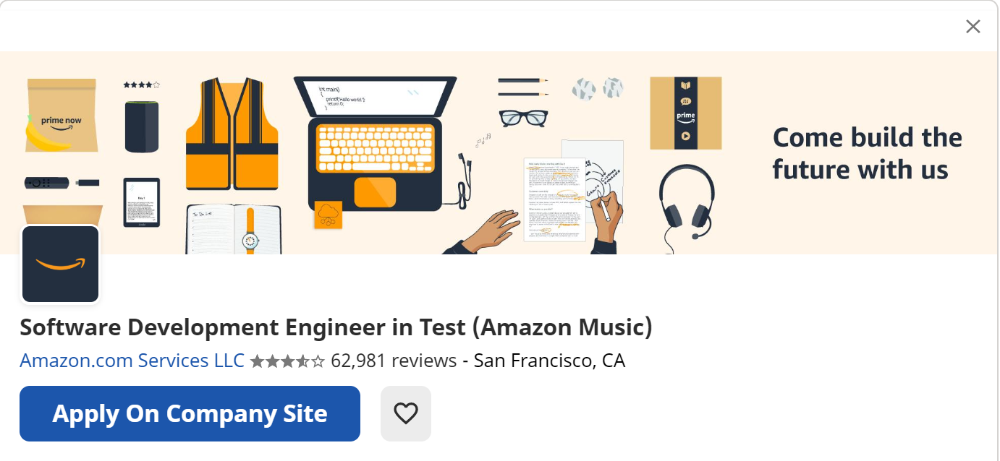

# Welcome to Nisha's home page


```markdown
Syntax highlighted code block

## Me
My name is Nisha Natarajan. I was born in India. I have been living in Australia for a long time. I studied school in Sydney and completed further study in Tafe till 2017. I speak Tamil and English. I like to walk/run. I used to play tennis and various sports also in the past. I like to listen to music or play music as a pastime. I have a cat which stays with me.

e-mail: nisha.natarajan2@gmail.com
student no: nnnn

## My interest in IT
Interest in IT developed few years ago due to my brother being in IT, but I did not learn further than required. It is just my general curiosity to know some basic programming and other aspects of IT.

I was accepted into RMIT to learn introductory programming though I am not progressing well to the extent I'd like to.

I expect to learn new concepts and developments in this field.

## Ideal Job


-- Bachelor’s degree in Computer Science, Computer Engineering or similar technical field
-- 3+ year’s of development experience as a Software Engineer in Test
-- Experience in object oriented designing and object oriented languages such as Java, .NET, Objective C, C++, Python, Ruby
-- Demonstrated experience in test framework design and development.
-- Experience in writing testing frameworks and automation tools is preferable
-- Experienced in mobile (iOS and Android) and backend API testing automation.
-- Experience influencing software engineering best practices within your team
-- Strong knowledge of QA methodology and tools, with demonstrated experience in an SDET role
-- Excellent communication, collaboration, reporting, analytical and problem solving skills.

## Personal profile
I do not need to do Myers-Briggs Type Indicator (MBTI) test. I know myself well. I am bit shy and nervous with people unless I know them well.

My aptitude is more towards languages than IT.

## Project idea

### Overview
I want to create an app that can listen to music and analyse it.

### Description
I will use artificial intelligence to find who are the people that will like the music.

### Tools and technologies
AI (I don’t know yet what is that)

### Skills
lots of IT skills

Outcome
The app that will benefit millions

